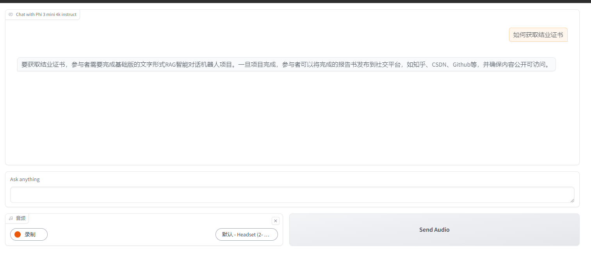
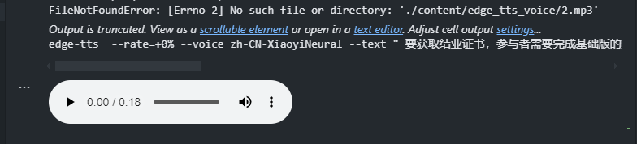

# NVIDIA-AI-AGENT
项目名称：NVIDIA AI AGENT 夏季训练营 - RAG 智能对话机器人

报告日期：2024/08/18

项目负责人： 潘海珲

## 项目概述
一个很偶然的机会，知道了这个训练营的信息。在此之前用过类似于ChatGPT、AZure Speech之类的服务，但是不了解这些服务是怎么工作
的，更不了解要如何搭建一个自己的服务。
非常感谢NVIDIA提供的这次机会，使我对这些有了基础的认知，也学会了如何使用 NVIDIA 提供的 NIM 微服务搭建自己的 AI Agent。
由于工作时间的关系，没有办法再训练营上投入太多时间，只是快速地过了一遍训练营的直播录屏。这里将介绍我自己学习的过程，希望对后面
看到的朋友能有所帮助。

在这个学习过程中，我搭建了一个集成了 edge-tts 能力的RAG智能对话机器人，这个机器人可以读取我提供的资料文档，然后针对资料内容回答我的问题。将文本转音频播放出来。

## 技术方案与实施步骤
- **模型选择**

    在测试过程中使用了ai-phi-3-small-128k-instruct模型，在此之前，试过使用microsoft/phi-3-vision-128k-instruct，但是发现agent 匹配的回答并不是来源于我提供的文档。切换到phi-3-small后，agent 提供的回答跟我提供的文档关联性更强。

    Embedding 使用的是 nvidia/nv-embed-v1

- **数据的构建**

    这个Agent最关键的一个步骤是输入需要的文档。然后对文档进行向量化处理。用这种方式可以弥补大模型信息无法实时更新的问题。通过这种方式我们可以很方便地让 agnet 协助我们处理各种信息。

## 实施步骤

- **环境搭建**

    在过去的开发中，已经习惯了使用VS Code 进行脚本编写的工作。因此我就直接使用 VS Code 进行实验。
    
    - 安装 Conda

        Conda 可以用于为 python 创建虚拟环境，便于在不同项目间进行切换。
        我选择的是 MiniConda，安装完毕后，使用命令行创建环境。在这个项目中，我提供了我实验过程中使用的环境配置文件，可以直接从配置文件导入

        ```PowerShell
        conda env create -n AIAgentEndPoint -f .\environment.yml
        conda activate AIAgentEndPoint
        ```

    - 创建测试工程

        在硬盘上新建一个文件夹，然后用 VS Code 打开。
        
    - 安装 VS Code 插件

        需要安装的插件有：
        - .Net Extension Pack
        - Python
        - Jupyter

        安装这三个插件就可以了，VS Code 会自动安装他们依赖的插件。

- **编写脚本**

    新建一个.ipynb文件。这个文件是 jupyter 的文件，用来调试非常方便，我也是第一次使用，很好用。
    
    项目中脚本是 AdvancedRAGDemo.ipynb，可供参考

- **运行脚本**

    在 .ipynb 文件上，点击双箭头按钮就可以运行脚本
    
    在末尾会有个url，用浏览器打开就可以尝试跟 Agent 聊天了。

### 成果与展示

- **使用场景**

    目前项目只导入了训练营项目报告模板，所以能针对训练营的报告模板来进行一定程度的答疑。

- **功能演示**

    如下图：




